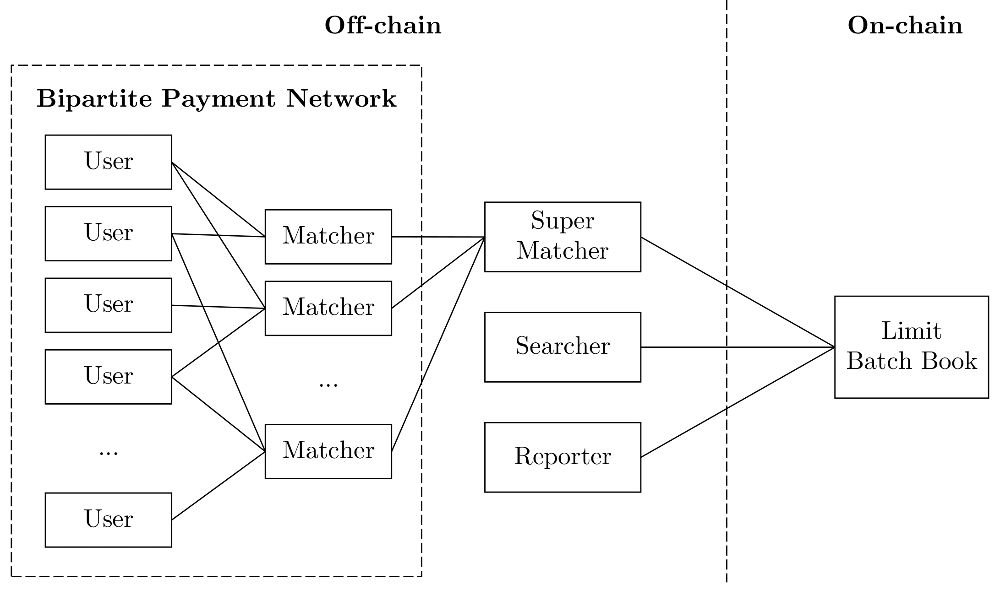

# ArgoX Protocol Implementation
## 1. Introduction
`ArgoX Protocol` is a decentralized exchange based on Limit Order Book. With the combination of Lightning network (State channel) and Batching mechanism to help increasing the speed, throughput and reduce the gas usage of the exchange. *This project has not been published yet.*

This repository is a Go implementation of the `ArgoX Protocol`. We have kept the system the same as the protocol but have made some simplifications to make it easier to implement.

We uses `Perun` - a state channel framework in Ethereum, as our State channel in the communication between an User and a Matcher. For more details, check this repo on GitHub: [`github.com/hyperledger-labs/go-perun`](https://github.com/hyperledger-labs/go-perun)

## 2. Architecture Overview


This diagram illustrates the relationships between the key entities in the `ArgoX Protocol`: **Matcher**
(for pre-batch order matching), **Super Matcher** (for managing and synchronizing batches), **Searcher** (for off-chain batch matching), and **Reporter** (for
monitoring on-chain batch execution)

## 3. Execution
### 3.1. With `run.sh` script
1. Access to `data` folder
2. Run the script with `./run.sh`
3. Waiting for the results

### 3.2. Run manually
#### 3.2.1 Run ganache 
```
ganache -a 200 -m '' -e 99999999999 --chain.chainId <CHAIN ID> --p <PORT>
```
<b>Example</b>, `ganache -a 200 -m '' -e 99999999999 --chain.chainId 1337 --p 8545>`


#### 3.2.2. Run protocol
```
go run . <PORT> <CHAIN ID> <NUMBER OF MATCHERS> <SEND TO> run <FILE TO LOAD ORDERS> <FOLDER TO SAVE RESULTS>
```
with, 
- `<NUMBER OF MATCHERS>` is the total number of matchers in the protocol
- `<SEND TO>` is the number of matchers to which the user must send an order each time
- `<FILE TO LOAD ORDERS>` is a path to an orders file that you want to run in the protocol
- `<FOLDER TO SAVE RESULTS>` is a path to a directory, which you want to save the protocol's results (price curves, gas used, run time, etc.)

<b>Example</b>, `go run . 8545 1337 5 1 run ./data/real_orders/real_orders_100.json ./data/results/priceCurve_1_5`

## Note
- Don't forget to restart your ganache before each run
- With each ganache blockchain, you can only run one program. So if you want to run multiple instances of the protocol at a time, you should start multiple ganache blockchains using **different ports and chain IDs**